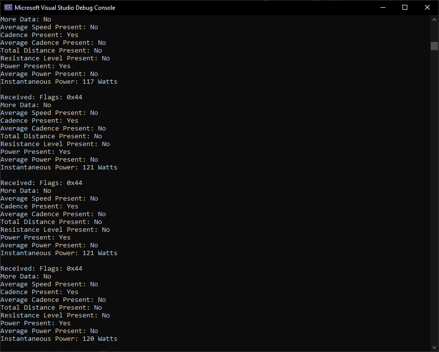

# VeloSim

Simulateur de route pour indoor trainer construit avec SimpleBLE (Windows)(https://github.com/OpenBluetoothToolbox/SimpleBLE)

Documentation SimpleBLE: [https://simpleble.readthedocs.io/en/latest/simpleble/tutorial.html](https://simpleble.readthedocs.io/en/latest/simpleble/tutorial.html)

https://www.bluetooth.com/wp-content/uploads/Files/Specification/HTML/Assigned_Numbers/out/en/Assigned_Numbers.pdf?v=1707000142462

Pour se connecter, choisir un des services / caractéristique suivants;

# UUIDS
- Fitness Machine Service (FTMS): 00001826-0000-1000-8000-00805f9b34fb
- Cycling Power Measurement: 00002ad2-0000-1000-8000-00805f9b34fb
- Heart Rate Service: 0000180d-0000-1000-8000-00805f9b34fb
- Heart Rate Measurement: 00002a37-0000-1000-8000-00805f9b34fb

## Screenshots

