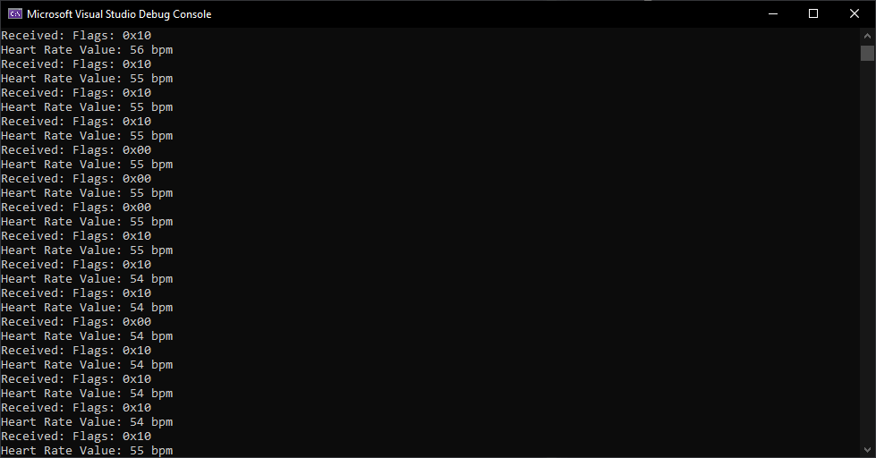

# VeloSim

Simulateur de route pour indoor trainer construit avec SimpleBLE (Windows)(https://github.com/OpenBluetoothToolbox/SimpleBLE)

Documentation SimpleBLE: [https://simpleble.readthedocs.io/en/latest/simpleble/tutorial.html](https://simpleble.readthedocs.io/en/latest/simpleble/tutorial.html)

## Screenshots

